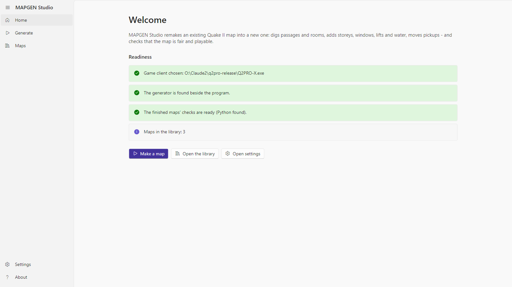
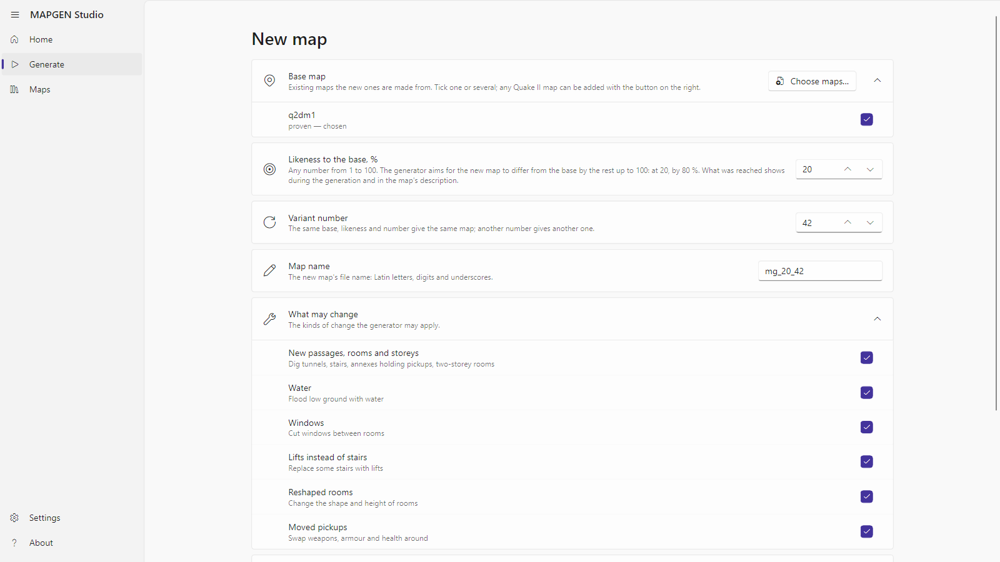
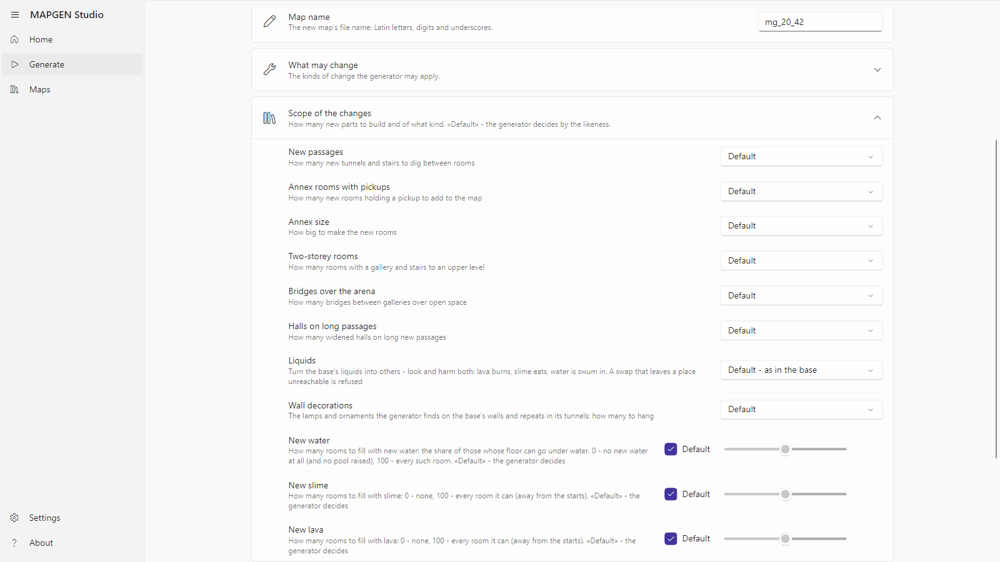
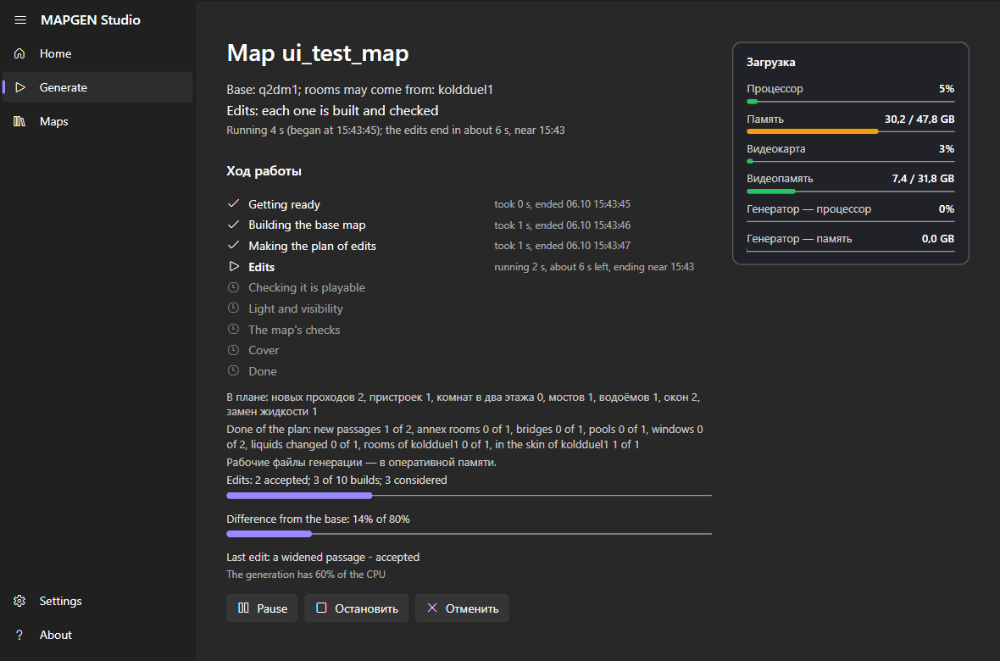
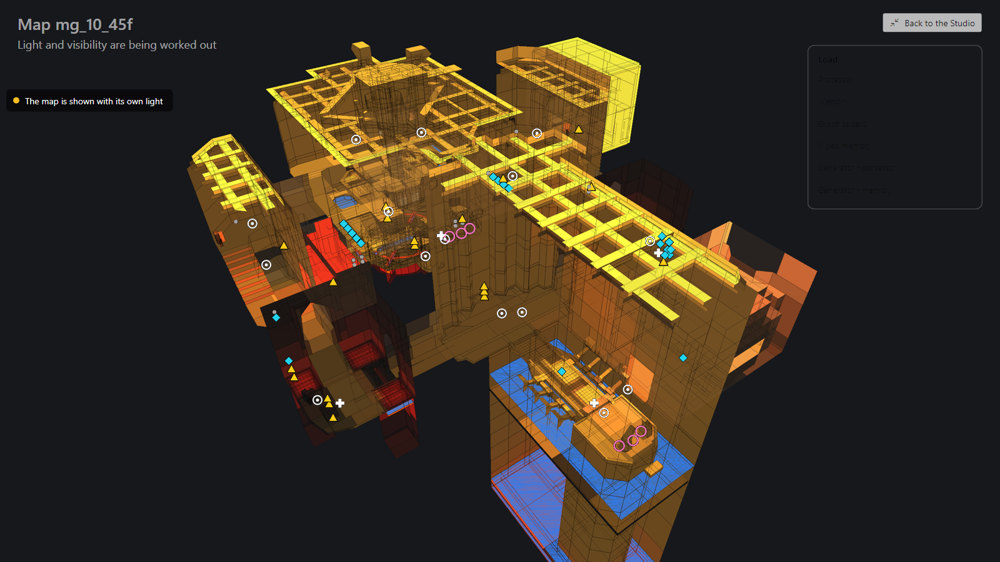
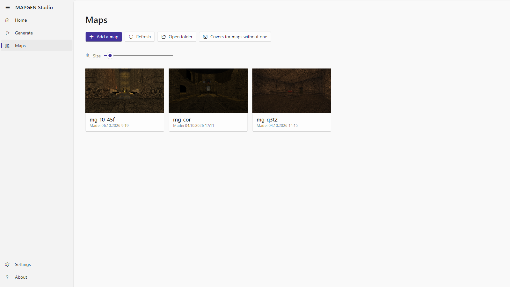
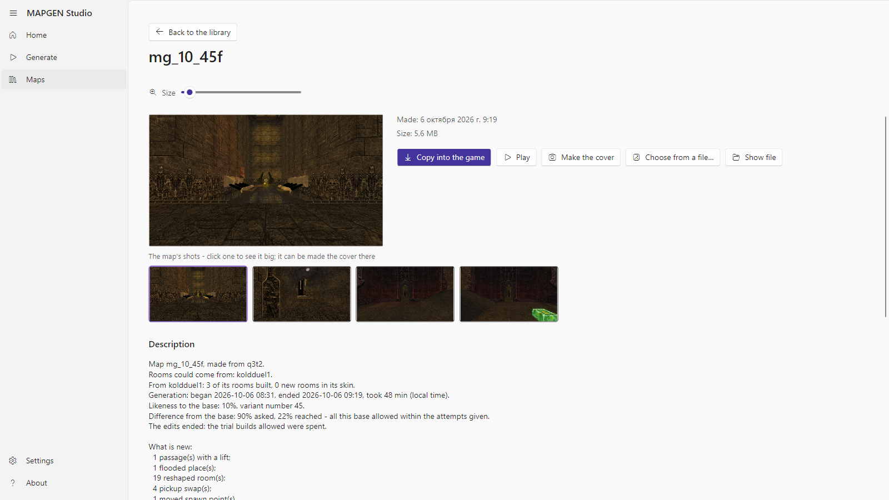
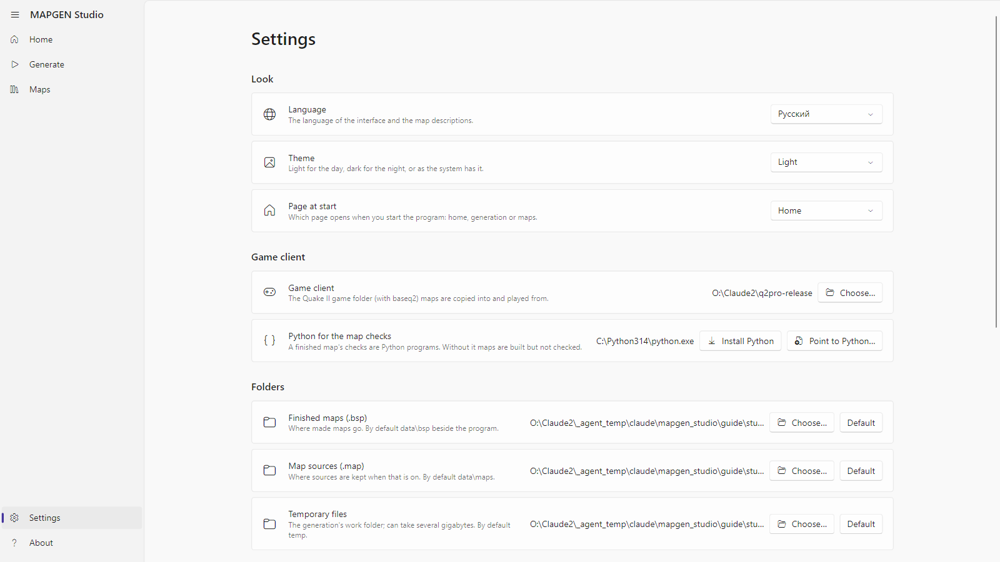
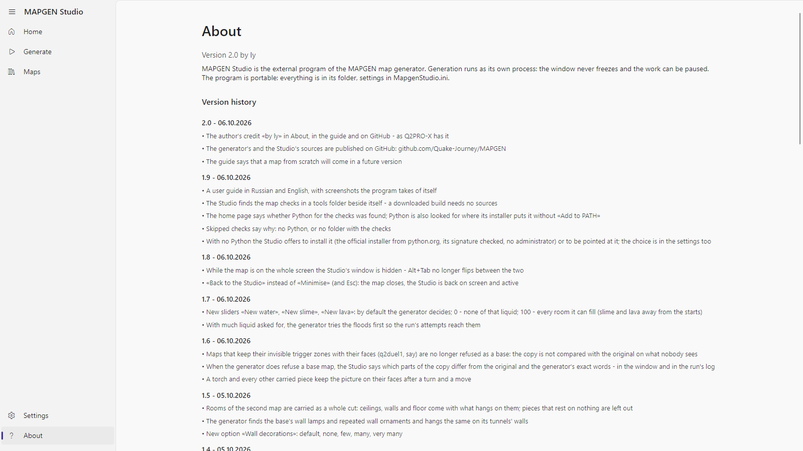

# MAPGEN Studio by ly — user guide

MAPGEN Studio turns an existing Quake II map into a new one: it digs passages through the rock, carries rooms over
from another map, floods low ground with water, lava or slime, changes the finish, moves items — and checks that the
new map can be walked, that it is lit and that nothing in it is broken. The base map stays as it is; the new map is
put beside it.

Today the program makes new maps out of existing ones. Building a new map from scratch, with no base map, will come
in a future version; it is not offered yet.

Every screenshot in this guide was taken by the program itself, from the version the guide ships with.

## What you need

- Windows 10 or 11, 64-bit.
- Quake II with its `baseq2` folder — any client: the textures come from it, and the game is started from it for
  the covers.
- Python 3.10 or newer — for the checks of a finished map. When there is none, the program offers to install it
  itself («Install Python» downloads the official installer from python.org and installs it for you only, no
  administrator needed) or to be pointed at one already installed («Point to Python…»). Without Python the map is
  still built, but the checks are skipped.
- Base maps: the program ships no maps. Any Quake II map file (`.bsp`) from your game can be added as a base from
  inside the program.

## First start

The home page says whether the program is ready:

- **Game client** — the folder with the game. If none is chosen, press «Open settings» and point at the folder that
  holds `baseq2`.
- **Generator** — the `engine` folder beside the program. It is part of the build; if it is missing, the build is
  damaged.
- **The finished maps' checks** — whether Python was found. When not, «Install Python» and «Point to Python…» are
  right there.
- **Maps in the library** — how many maps have been made.

Three buttons lead to the main sections: «Make a map», «Open the library», «Open settings». The same sections are
in the menu on the left: Home, Generate, Maps, Settings, About.

## Generate

### Base map

Tick one map or several. «Choose maps…» adds any Quake II map file from the disk — it is copied next to the program
and stays in the list. Each map says whether the generator has already been proven on it or this is a first trial.

With several maps ticked, choose what to make of them:

- **A map from each** — every ticked map becomes the base of its own new map, one after another.
- **One map from several** — the first ticked map is the base; from the others the generator takes rooms and carries
  them into the rock whole, with their walls, ceiling, lamps and ornaments.

### Likeness and variant

- **Likeness to the base, %** — how much the new map should stay like the old one. 90 is almost the same map with
  a few changes; 10 lets the generator change everything it can. Any number from 1 to 100.
- **Variant number** — the number that decides which changes are picked. The same base, likeness and number give the
  same map; another number, another map.
- **Map name** — Latin letters and digits. The program suggests one: `mg_` + likeness + variant number.

### Scope of the changes

«Scope of the changes» opens the extra options. Each has a «Default» — then the generator decides by the likeness.
Any other value is your direct order:

- **New passages** — how many new tunnels and stairs to dig through the rock between rooms.
- **Annex rooms with pickups** and **Annex size** — how many annex rooms with a weapon or armour to add, and how big
  (small, medium, large, halls).
- **Two-storey rooms** — how many rooms get a gallery and stairs to an upper level.
- **Bridges over the arena** — how many bridges to throw over open space.
- **Halls on long passages**.
- **Liquids** — turn the base's liquids into others: water to lava, lava to water, slime to lava and so on, or mix.
  Look and harm both change: lava burns, slime eats, water is swum in.
- **Wall decorations** — the generator finds the base's lamps and repeated ornaments on its walls and hangs the same
  in its tunnels: none, few, many, very many.
- **New water**, **New slime**, **New lava** — three sliders. By default the generator decides; 0 adds none of that
  liquid; 100 fills every room it can. The generator floods only rooms with a level floor and no room underneath,
  and never cuts off an item or a way. Lava and slime stay away from the player starts; passages between rooms are
  flooded with water only.

«What may change» lists the families of changes; any can be switched off.

«Keep the map source (.map)» leaves the source beside the finished map, for a map editor.

«Start generating» starts the work.

## A run

The run's page shows:

- **The stages**: Getting ready → Building the base map → Making the plan of edits → Edits → Checking it is
  playable → Light and visibility → The map's checks → Cover → Done. The stage under way shows its time; a finished one, when it ended.
- **Edits** — how many were accepted, how many builds were spent of those allowed, how many were considered, and
  how far the map already differs from the base.
- **Done of the plan** — what of the plan was built: new passages, annexes, pools, windows, rooms from the second
  map.
- **The map's scheme** — the plan from above or at a slant, with the accepted changes on it and, at the light
  stage, how the map is lit. «Full screen» puts the scheme on the whole screen; while it is there, the program's
  window is hidden.
- **Load** — CPU, memory, GPU, video memory: the whole machine's and the generator's own.
- **Detailed log** — the lines the generator writes.

On the full screen, «Back to the Studio» (or Esc) closes it and brings the program's window back.

The buttons under the stages:

- **Pause** / **Resume** — the generator stops where it is and goes on from there.
- **Stop** — the run is interrupted; it can be resumed later from the same place on the Generate page (a card
  «An interrupted generation» appears there with «Resume» and «Delete»), when «Keep the accepted steps on the disk» is on in the settings.
- **Cancel** — the run stops and all its working files are deleted.

When the map is ready the program says so and puts the map into the library. Failed checks are said too, with the
details in the map's description.

### When the generator refuses

First of all the generator turns the base map back into its source and builds it again, to change that copy later.
When the copy differs from the original it leaves such a map alone and says in what: for example «what is drawn on
the walls» — with the generator's exact words under it. The same goes to the log.

## The library

«Maps» shows every finished map as a tile with its cover. The tiles are sized by the «Size» slider or by the mouse
wheel with Ctrl held. «Add a map» brings any map from the disk into the library; «Refresh» rereads the folder;
«Open folder» opens it in Explorer.

A click on a tile opens the map:

- **Description** — the base it was made from, the maps that gave rooms, likeness and variant number, what was
  built, how long the run took.
- **The map's checks** — every check marked «passed» / «NOT passed», with a plain explanation.
- **Shots** — a click opens a shot large; the arrows page through the rest, Esc closes; any shot can be made the
  cover. «Make the cover» starts the game on the map, takes a few views and closes it; «Choose from a file…» takes a
  cover from your own picture.
- **Play** — starts the game on this map. Your game settings are not changed.
- **Copy into the game** — puts the map into your client's maps folder.

## Settings

- **Look**: language (Russian or English), theme, «Page at start».
- **Folders**: finished maps, map sources, temporary files. Any can be changed or set back to «Default».
- **Game client** — the folder with the game that holds `baseq2`.
- **Python for the map checks** — which Python the program uses; it can be installed or pointed at here too.
- **CPU load** — what share of the CPU the generator may take by day and by night, and which hours count as day.
  The generator never takes more; the rest stays yours.
- **Memory and disk** — how much free memory the generator's working files may take (the disk is then hardly used),
  and whether to «Keep the accepted steps on the disk» — without them an interrupted run cannot be resumed.
- **Shoot covers automatically** — after every finished map the program starts the game itself and takes a cover.

The settings are kept in a file beside the program; where exactly is written at the bottom of the page.

## About

The program's version and the version history: what changed in each, the newest on top.

## When something is wrong

- **«Game client not chosen»** — point the settings at the game folder; it must hold a `baseq2` folder.
- **«Generator not found»** — there is no `engine` folder beside the program. Unpack the build again, whole.
- **«The map's checks were skipped: Python was not found»** — press «Install Python» on the home page or in the
  settings (or «Point to Python…» when it is installed) and start the run again; the map does not change, only the
  checks appear.
- **«The map failed: the generator could not rebuild this base map exactly»** — the message says in what the copy
  differs from the original. Such a map cannot be a base yet; try another.
- **The run was interrupted** — the Generate page has a card «An interrupted generation» with «Resume».
- **The generator crashed** — the program shows where the crash record lies; send it to the developer, and resume
  the run from the same place.

## In future versions

- **A map from scratch** — a new map with no base map. The generator can already do it in a rough form, but the
  program does not offer it yet: it will come once the maps made from existing ones reach the quality they need.

## Where the files are

- Finished maps: the «Finished maps (.bsp)» folder of the settings; by default `data\bsp` beside the program.
- Descriptions, covers and shots: `data\descriptions`, `data\covers`.
- A run's working files: the «Temporary files» folder; after a finished map they are deleted, and a small report of
  the run stays in `data\runs\<map name>`.
- Settings: `MapgenStudio.ini` beside the program.
