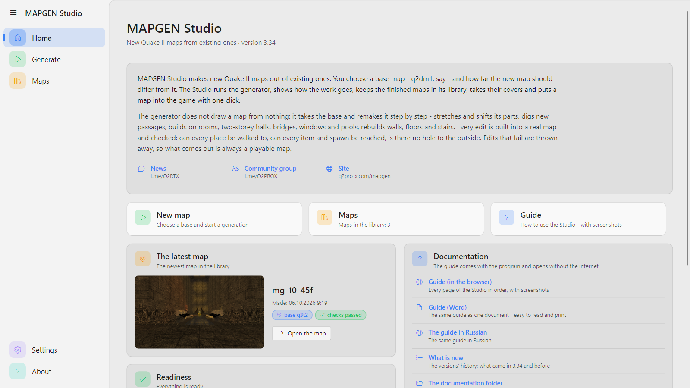
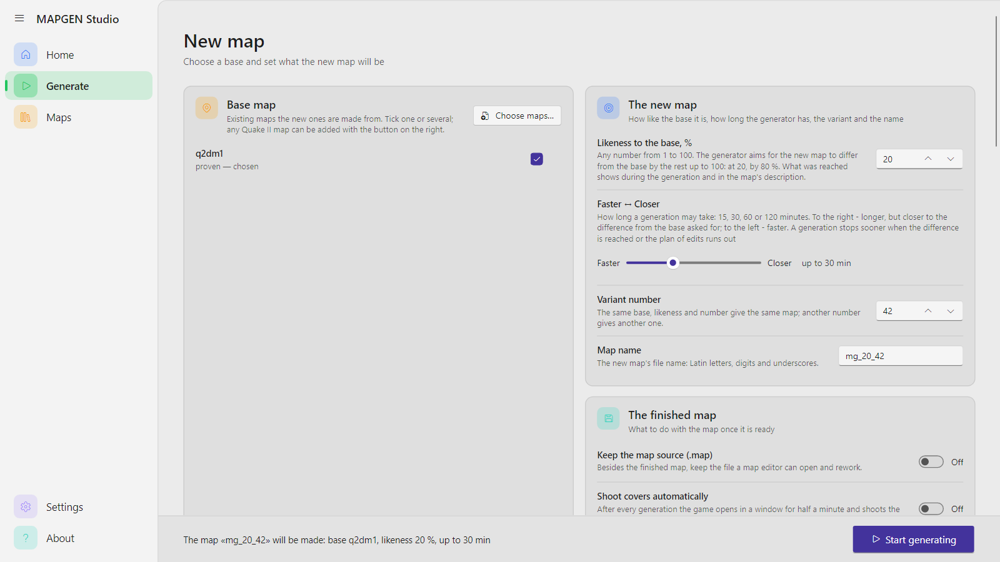
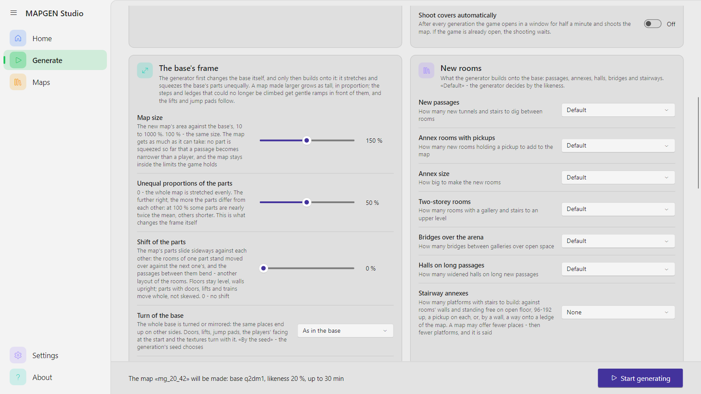
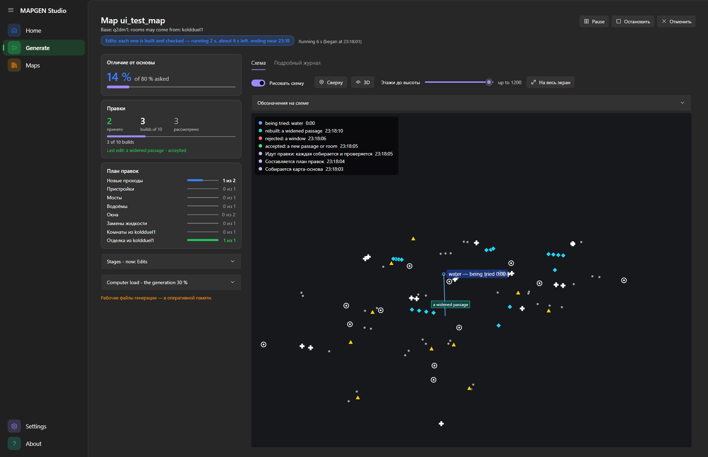
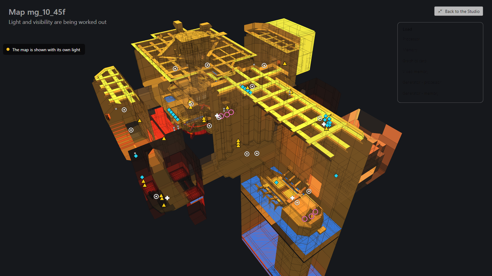
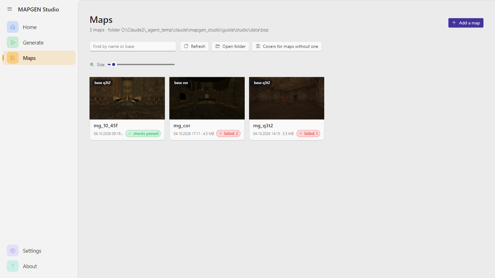
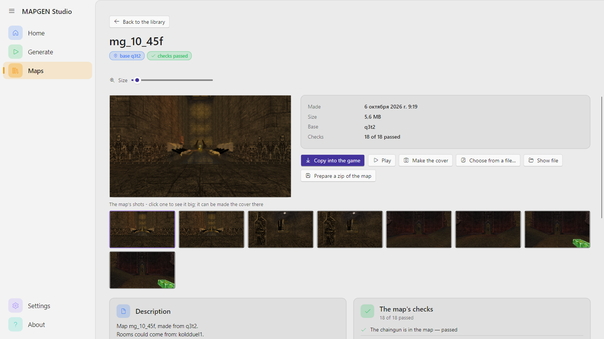
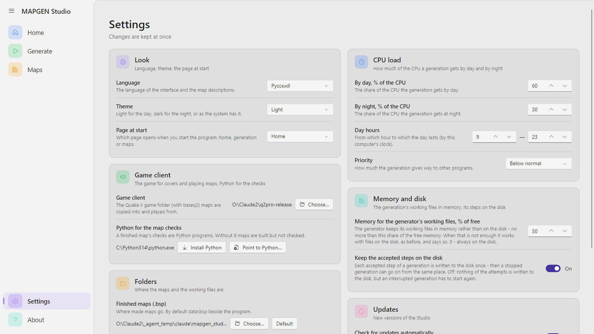
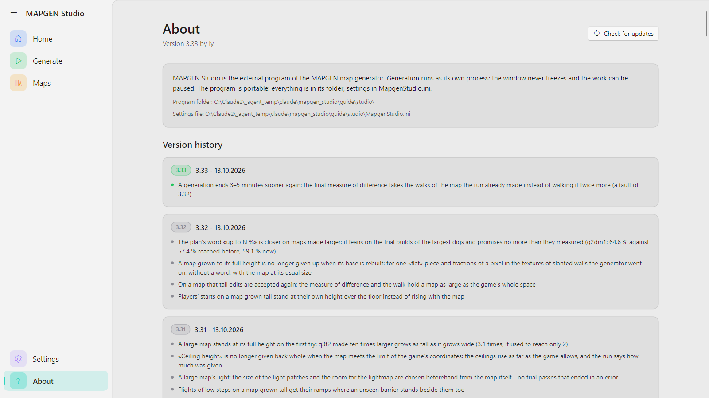

# MAPGEN Studio by ly — user guide

MAPGEN Studio turns an existing Quake II map into a new one: it digs passages through the rock, carries rooms over
from another map, floods low ground with water, lava or slime, changes the finish, moves items — and checks that the
new map can be walked, that it is lit and that nothing in it is broken. The base map stays as it is; the new map is
put beside it.

Today the program makes new maps out of existing ones. Building a new map from scratch, with no base map, will come
in a future version; it is not offered yet.

Every screenshot in this guide was taken by the program itself, from the version the guide ships with.

## What you need

- Windows 10 or 11, 64-bit.
- Quake II with its `baseq2` folder — any client: the textures come from it, and the game is started from it for
  the covers.
- Python 3.10 or newer — for the checks of a finished map. When there is none, the program offers to install it
  itself («Install Python» downloads the official installer from python.org and installs it for you only, no
  administrator needed) or to be pointed at one already installed («Point to Python…»). Without Python the map is
  still built, but the checks are skipped.
- Base maps: the program ships no maps. Any Quake II map file (`.bsp`) from your game can be added as a base from
  inside the program.

## First start

While the Studio is loading, a loading window shows how much is done and what is being done now (the window look,
reading the map library, the newest map's cover, finding Python and the game, loading the Studio). The share is
weighed by how long each step took at the last start, so on a slow computer or disk the bar moves as that machine
loads. The first start after installing takes longer than usual.

On the left is the menu: **Home**, **Generate**, **Maps**, and at the bottom **Settings** and **About**. Each section
has its coloured sign; the one under the mouse lights up, the open one stands out in its colour with a bar on the
left. The ☰ button at the top folds the menu to its signs and opens it again.

On the home page:

- **Two paragraphs on the Studio and its generator** — what they do and why what comes out is always playable.
- **The community's links** under them: **News** (the Telegram channel, https://t.me/Q2RTX), **Community group**
  (the Telegram group, https://t.me/Q2PROX) and **Site** (https://q2pro-x.com/); they open in the browser.
- **Three large buttons**: «New map» — to the generation, «Maps» — to the library (the button says how many maps it
  holds), «Guide» — opens this guide.
- **The latest map** — the newest map in the library: its cover, base, checks and «Open the map». While a run goes
  on, what it is doing now and «Open the run» stand there instead.
- **Readiness** — whether everything is set: the game client (the game's folder that holds `baseq2`), the generator
  (the `engine` folder beside the program; without it the build is damaged), Python and the finished maps' checks.
  When something is missing, the button to fix it is right there: «Open settings», «Install Python», «Point to
  Python…».
- **Documentation** — the guide comes with the program (the `doc` folder beside it) and opens without the internet:
  in the browser, in Word, in Russian; «What is new» — the versions' history; the documentation folder.
- **How to make a map** — four steps.

**The run strip.** While a run goes on, a strip stands over every page but the run's own: the map's name and its
base, what is going on now and how long is left, the difference from the base, how many edits were accepted and how
many builds made, a bar and «Open the run» (a click on the strip does the same). Once the run is over, the strip
stays until you look at its page.

## Generate

The page is laid out in cards, two columns. At the top left — **Base map**; beside it on the right — **The new
map** (likeness to the base, the generation's time, the variant number, the name) and **The finished map** (keep its
source, take covers by itself). The bases' card is as tall as the two cards beside it together; when the list holds
more maps than fit, it scrolls inside the card. Under them are the generation's options, cards by group, two in a
row and one height: **The base's frame** and **New rooms**, **The base rebuilt** and **Water, slime, lava**,
**Ruin** and **What may change**. At the page's foot, wherever you are on the page, the line «The map … will be made: base …,
likeness …, up to … min» and the **«Start generating»** button.

### Base map

Tick one map or several. «Choose maps…» adds any Quake II map file from the disk — it is copied next to the program
and stays in the list. Each map says whether the generator has already been proven on it or this is a first trial.

With several maps ticked, choose what to make of them:

- **A map from each** — every ticked map becomes the base of its own new map, one after another.
- **One map from several** — the first ticked map is the base; from the others the generator takes rooms and carries
  them into the rock whole, with their walls, ceiling, lamps and ornaments.

### Likeness and variant

- **Likeness to the base, %** — how much the new map should stay like the old one. 90 is almost the same map with
  a few changes; 10 lets the generator change everything it can. Any number from 1 to 100.
- **Variant number** — the number that decides which changes are picked. The same base, likeness and number give the
  same map; another number, another map.
- **Map name** — Latin letters and digits. The program suggests one: `mg_` + likeness + variant number.

### The base's frame

Before building anything onto it, the generator may change the base itself:

- **Size** — the new map's area against the base's, 10 to 1000 %. A map made larger grows as tall, in proportion:
  halls become taller as well as wider. The steps and ledges that could no longer be climbed get gentle ramps or
  small flights in front of them; the gaps in gratings a player could not fall through are bridged; lifts and jump
  pads follow the new height. When full height leaves somewhere unwalkable, the generator tries a little less height
  until the whole map walks. A map made smaller keeps its height. Items and players' starts stay at their own
  height over the floor. The light of a large map is computed with a step chosen for its size — a map made several
  times larger does not come out dark.
- **Spread** — how unequally the base's parts stretch.
- **Shift** — how far the parts slide sideways against each other.
- **Turn** — the whole base turned or mirrored.
- **Ceiling height** — over the proportional height: everything above the highest place a player can stand is lifted
  further. 100 % — in proportion to the map's size. On a very large map the ceilings may run out of room — the
  game's coordinates are limited; they then rise as far as the game holds, and the run's log says so in a line like
  «The ceilings rose to 134 % of the 200 % asked: the game's coordinates hold no more».

### Scope of the changes

How much of what to build is set by the cards under the base: **New rooms** (passages, annexes, halls, bridges,
stairways), **The base rebuilt** (walls, blocks, the floor, stairs, ornaments), **Water, slime, lava** and **Ruin**.
Each option has a «Default» — then the generator decides by the likeness. Any other value is your direct order:

- **New passages** — how many new tunnels and stairs to dig through the rock between rooms.
- **Annex rooms with pickups** and **Annex size** — how many annex rooms with a weapon or armour to add, and how big
  (small, medium, large, halls).
- **Two-storey rooms** — how many rooms get a gallery and stairs to an upper level.
- **Bridges over the arena** — how many bridges to throw over open space.
- **Halls on long passages**.
- **Liquids** — turn the base's liquids into others: water to lava, lava to water, slime to lava and so on, or mix.
  Look and harm both change: lava burns, slime eats, water is swum in.
- **Wall decorations** — the generator finds the base's lamps and repeated ornaments on its walls and hangs the same
  in its tunnels: none, few, many, very many.
- **New water**, **New slime**, **New lava** — three sliders. By default the generator decides; 0 adds none of that
  liquid; 100 fills every room it can. The generator floods only rooms with a level floor and no room underneath,
  and never cuts off an item or a way. Lava and slime stay away from the player starts; passages between rooms are
  flooded with water only.
- **Stairway annexes** — from «None» to 10. The generator builds new platforms 96-192 high with stairs up to them:
  along rooms' walls and standing free on open floor (at most half of them). A pickup of that part of the map stands
  on each, or, by a wall, the platform leads onto a ledge of the map. It finds the places on any base by itself - a level floor, room around it and above it; when the map has
  fewer places than asked, there are fewer platforms, and the map's description says so.
- **Remodel the base** — how many times to change the base map itself rather than build onto it: a room's wall
  moved in, a wall turned at an angle, a terrace with steps raised along a wall.
- **Blocks in the rooms** — how many blocks to stand in the base's own rooms: a box, an L, a cross, an octagon or a
  round one, 64 to 192 across, turned at different angles. Low ones (32-64) to climb, high ones (96-128) a cover;
  against a wall or free, in the room's own material.
- **Floor: daises and channels** — how many times to change the base's own floor: raise a dais stepped on every
  side (a box or an octagon, 32-80 high) or sink a channel across the floor (32-64 deep) with a flight at both ends.
  A channel is dug only where no other room lies under the floor; the arena first.
- **Rebuild the base's stairs** — how many of the base's own stairs to rebuild in another shape between the same
  two floors: the old flight becomes a landing, reached by a half-round foot of steps or by a side flight. It needs
  open flat floor in front of the stair.

  For all four «Default» lets the generator decide by the likeness (the less alike, the more changes). When a map
  offers fewer places than asked, fewer are made, and the map's description says so.
- **Destruction** — a slider from 0 to 100 %. At 0 the map is made as usual, with every passage check. The higher,
  the more is destroyed: cracks in walls and floors, rubble, craters, breaches in walls, broken ledge edges, fallen
  ceilings, blocked corridors; at 100 almost the whole level. The player starts always stay free and no pickup is
  buried; passage, though, is not guaranteed. For the ruin the generator uses its own texture pack (earth, stone,
  concrete, brick, metal, gravel and more) matched to the map's own colours; the pack goes into the game's folder
  with the map.

The «What may change» card lists the families of changes; any can be switched off.

In the «The finished map» card: «Keep the map source (.map)» leaves the source beside the finished map, for a map
editor; «Shoot covers automatically» — after every finished map the program starts the game itself and takes a cover.

The generator cuts windows by itself, as many as the likeness allows: fixed glass, glass that drops when shot and
comes back after a while, and glass a pressure plate on the floor opens. Windows come in different outlines -
rectangular, round or oval, arched, with a transom and a vent - and with different glass: pale, blue, wired
lavender and grey, amber, olive, smoke.

«Start generating» starts the work. When the map's name is taken — the library has a map of that name, a past
generation's records are there, such a generation is running, queued or interrupted — the program asks first:
**Overwrite** (the new map replaces the old one with its records), **Correct the name** (the page scrolls to «Map name»,
the cursor in it) or **Cancel**. A running generation cannot be overwritten — only the name corrected or
the generation cancelled.

## A run

The page is in two parts: on the left what matters about the run, on the right the map's scheme the window's whole
height.

**At the top** — the map's name and the base it is made from. Under them a coloured badge with what is going on now
and its time: blue — running, yellow — paused, green — the map is ready, red — the run failed. Beside it, how long
the run has gone and when it began. The buttons are on the right.

**On the left**, always open:

- **Difference from the base** — large, how far the map already differs from the base in percent, of how many
  asked, and a bar. Under it, what the plan promises: how far it can change the map in the builds allowed.
- **Edits** — three numbers: how many edits were accepted (green), how many builds were made and how many edits were
  considered. Under them the run's time bar, and below the last edit: green when accepted, red when refused. After
  the edits the generator swaps liquids, moves items and tries rooms of other maps — that shows here too («N of M»).
- **The plan** — a table: what is planned by kind (new passages, annex rooms, two-storey rooms, bridges, pools,
  windows, stairway annexes, remodels of the base, rooms of the second map and others), with a bar and «done of
  planned». A kind done turns green. Destruction comes after the edits and the checks; its percent is named under
  the table.

**On the left**, folded (a click on the header opens and closes it):

- **Stages** — Getting ready → Building the base map → Making the plan of edits → Edits → Checking it is playable
  → Light and visibility → The map's checks → (Destruction - when asked for) → Light on the finished map → Cover →
  Done. The stage under way shows its time; a finished one, how long it took and when it ended. The stage now is
  named in the folded header too.
- **Computer load** — CPU, memory, GPU, video memory: the whole machine's and the generator's own. The header says
  the share of the CPU the run has.

**On the right**, two tabs:

- **Scheme** — the plan from above or at a slant, with the edits on it (stairway annexes too, and, at the
  destruction stage, every crater, breach, fallen ceiling and debris pile as it is built) and, at the light stage,
  how the map is lit. The buttons over it: draw it or not, the view from above, the 3D view, the storeys up to which
  height, and «Full screen» — the scheme on the whole screen, the program's window hidden. **«What the scheme
  shows»** (folded) explains the signs in an even table: the edits (being tried, refused, accepted, base changed),
  what is still in the plan, the map's colours (floor, water, lava, slime, lifts and doors) and the items (weapons,
  armour, health, ammo, power-ups, spawns, teleporters). Hover a sign for the detail, e.g. «a refused edit - red,
  fades in 10 seconds». The mouse controls are there too.
- **Detailed log** — the lines the generator writes.

**The stages on the scheme.** Each stage shows on the scheme itself:

- **The base's frame changing** — the scheme shows the base itself easing into its new shape and back while the
  generator tries the frame. Its parts are tinted apart, the orange lines are the parts' edges, the item signs move
  with the map. The words at the top right say the size and the parts' spread.
- **Light and visibility — the visibility.** The portals between the map's parts show: cyan not worked out yet, green
  worked out. The wave spreads from a spawn; along its front an «eye» walks with cyan sight lines to the portals
  checked next, the ones just reached marked by widening rings. The words say how many portals are done of how many.
  The 3D view shows it best: from above many portals stand edge-on.
- **Light and visibility — the light.** Each lamp of the map glows in its colour; rays spread from the lamps as the
  direct light is worked out, and the glow pulses through the bounced light. Spotlights show where they point. The
  words say how many lamps and how much is done.

On the full screen, «Back to the Studio» (or Esc) closes it and brings the program's window back.

The buttons at the top right:

- **Pause** / **Resume** — the generator stops where it is and goes on from there.
- **Stop** — the run is interrupted; it can be resumed later from the same place on the Generate page (a card
  «An interrupted generation» appears there with «Resume» and «Delete»), when «Keep the accepted steps on the disk» is on in the settings.
- **Cancel** — the run stops and all its working files are deleted.

When the map is ready the program says so and puts the map into the library. Failed checks are said too, with the
details in the map's description.

### When the generator refuses

First of all the generator turns the base map back into its source and builds it again, to change that copy later.
When the copy differs from the original it leaves such a map alone and says in what: for example «what is drawn on
the walls» — with the generator's exact words under it. The same goes to the log.

## The library

«Maps» shows every finished map as a tile. Over the cover — the map's base and how far it differs from it; under the
cover — its name, when it was made, its size and its checks: green «checks passed» or red «failed: N». «Find by name
or base» leaves only the maps that match. The tiles are sized by the «Size» slider or by the mouse wheel with Ctrl
held. «Add a map» (top right) brings any map from the disk into the library; «Refresh» rereads the folder; «Open
folder» opens it in Explorer.

A click on a tile opens the map. At the top its name and the same marks (base, difference, checks); beside the cover
its facts (made, size, base, difference from the base, how many checks passed) and the buttons; below, its
description and checks in two cards:

- **Description** — the base it was made from, the maps that gave rooms, likeness and variant number, what was
  built, how long the run took.
- **The map's checks** — every check marked «passed» / «NOT passed», with a plain explanation.
- **Shots** — a click opens a shot large; the arrows page through the rest, Esc closes; any shot can be made the
  cover. «Make the cover» starts the game on the map, takes a few views and closes it; «Choose from a file…» takes a
  cover from your own picture.
- **Play** — starts the game on this map. Your game settings are not changed.
- **Copy into the game** — puts the map into your client's maps folder.

## Settings

The settings are laid out in cards, two columns: Look, Game client, Folders, CPU load, Memory and disk, Updates.
Each setting is a row: on the left what it does, on the right the setting itself.

- **Look**: language (Russian or English), theme, «Page at start».
- **Folders**: finished maps, map sources, temporary files. Any can be changed or set back to «Default».
- **Game client** — the folder with the game that holds `baseq2`.
- **Python for the map checks** — which Python the program uses; it can be installed or pointed at here too.
- **CPU load** — what share of the CPU the generator may take by day and by night, and which hours count as day.
  The generator never takes more; the rest stays yours.
- **Memory and disk** — how much free memory the generator's working files may take (the disk is then hardly used),
  and whether to «Keep the accepted steps on the disk» — without them an interrupted run cannot be resumed.
- **Updates** — «Check for updates automatically» (on) and «Check for updates». When GitHub has a newer version, the
  program shows its number and all the changes (newest on top) and asks: «Yes» downloads, checks and installs it
  (your maps and settings stay; the program restarts and shows «What's new»), «Cancel» — not now, and it asks again
  at the next start.

The settings are kept in a file beside the program; where exactly is written at the bottom of the page.

## About

The program's version and «Check for updates» (top right), what the program is, where it and its settings file
are; below, the versions' history as cards: what changed in each, the newest on top and marked.

## When something is wrong

- **«Game client not chosen»** — point the settings at the game folder; it must hold a `baseq2` folder.
- **«Generator not found»** — there is no `engine` folder beside the program. Unpack the build again, whole.
- **«The map's checks were skipped: Python was not found»** — press «Install Python» on the home page or in the
  settings (or «Point to Python…» when it is installed) and start the run again; the map does not change, only the
  checks appear.
- **«The map failed: the generator could not rebuild this base map exactly»** — the message says in what the copy
  differs from the original. Such a map cannot be a base yet; try another.
- **The run was interrupted** — the Generate page has a card «An interrupted generation» with «Resume».
- **The generator crashed** — the program shows where the crash record lies; send it to the developer, and resume
  the run from the same place.

## In future versions

- **A map from scratch** — a new map with no base map. The generator can already do it in a rough form, but the
  program does not offer it yet: it will come once the maps made from existing ones reach the quality they need.

## Where the files are

- Finished maps: the «Finished maps (.bsp)» folder of the settings; by default `data\bsp` beside the program.
- Descriptions, covers and shots: `data\descriptions`, `data\covers` (the game's shots are kept as JPEGs - a tenth
  of the PNG with the same look; the shots of earlier versions the Studio recompresses itself after it starts). The
  covers' small copies for the tiles are in `temp\thumbs`; they may be deleted, the Studio makes them again.
- A run's working files: the «Temporary files» folder; after a finished map they are deleted, and a small report of
  the run stays in `data\runs\<map name>`.
- Settings: `MapgenStudio.ini` beside the program.
