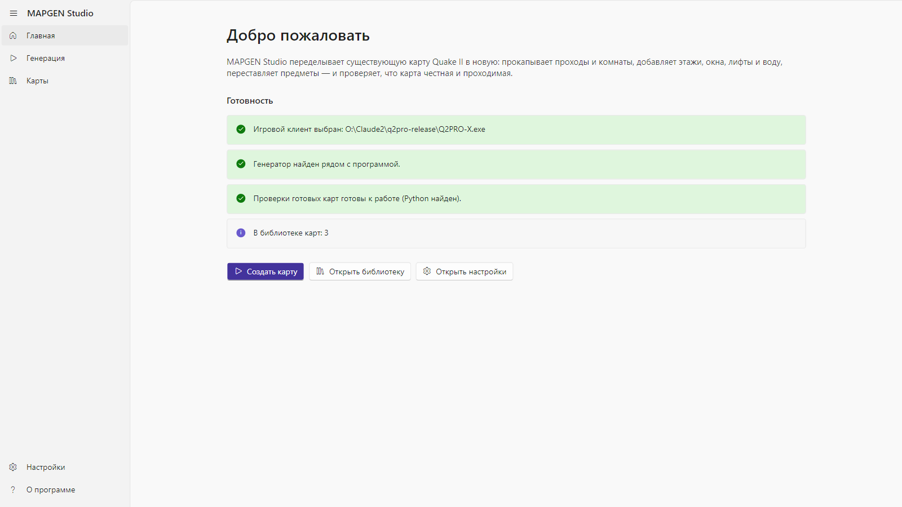
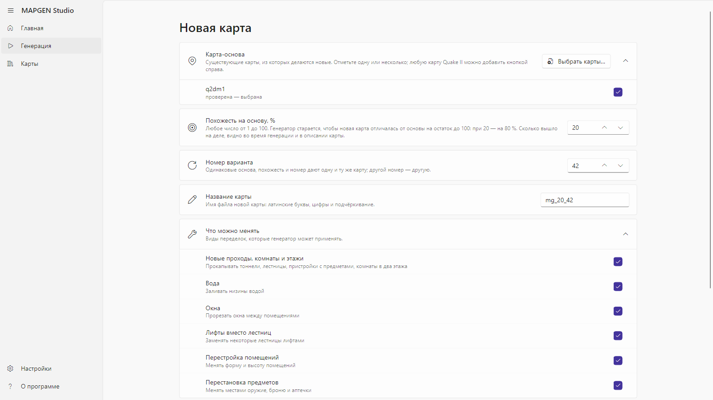
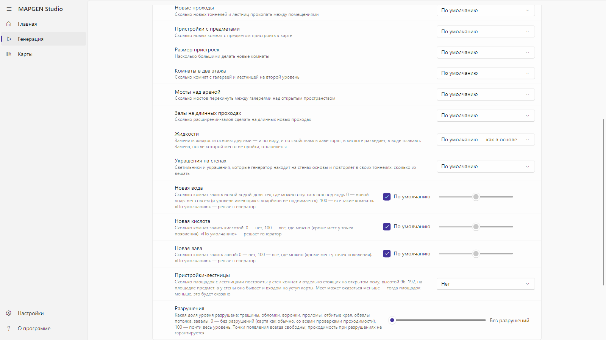
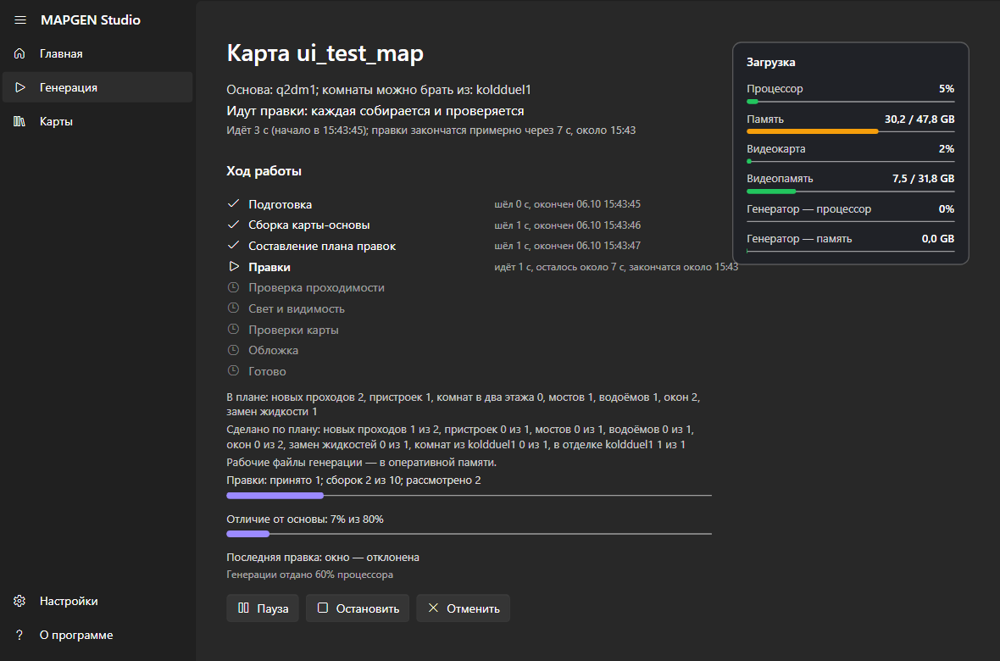
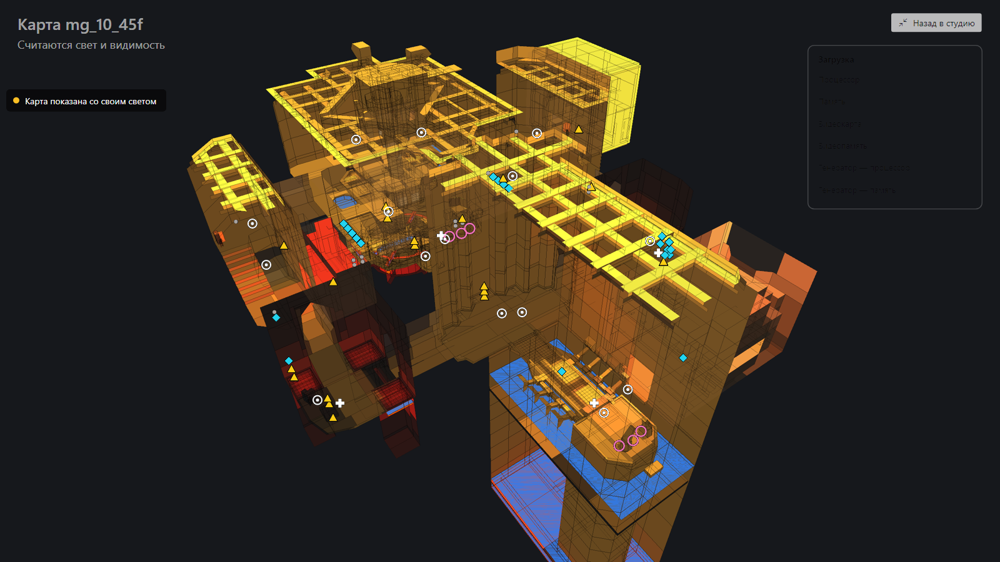
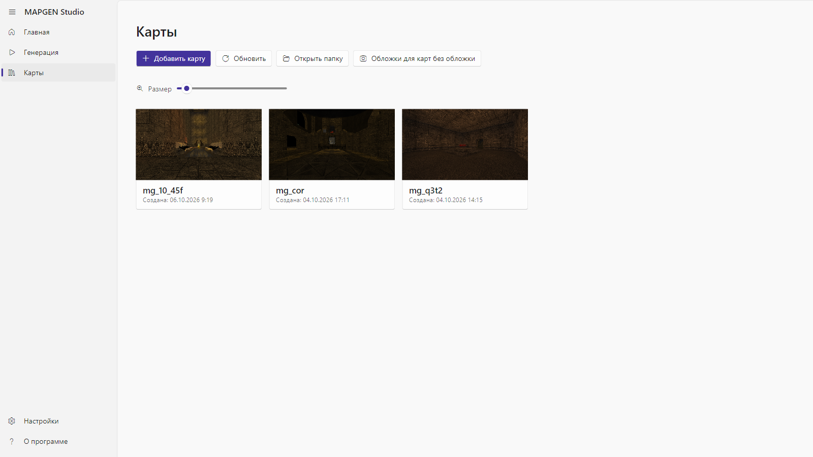
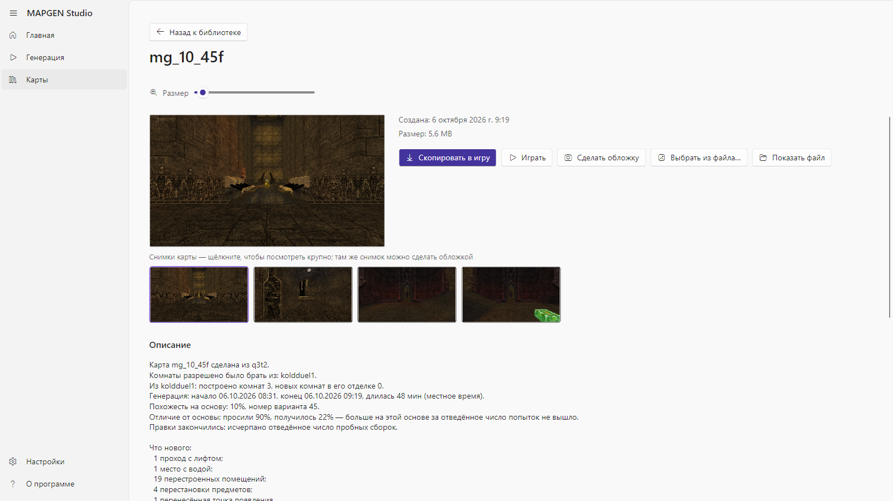
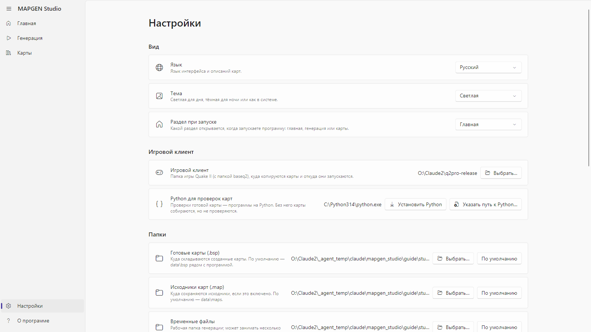
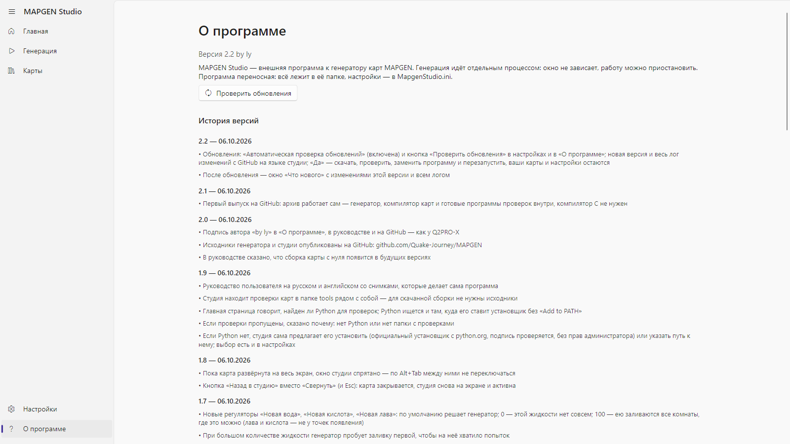

# MAPGEN Studio by ly — руководство

MAPGEN Studio переделывает готовую карту Quake II в новую: прокладывает проходы в скале, переносит комнаты из
другой карты, заливает низины водой, лавой или кислотой, меняет отделку, переставляет предметы — и проверяет,
что по новой карте можно пройти, что она освещена и что в ней ничего не сломано. Карта-основа при этом
остаётся на месте, новая карта кладётся рядом.

Сейчас программа делает новые карты из уже готовых. В будущих версиях появится и сборка новой карты с нуля,
без карты-основы; пока эта возможность не предоставляется.

Все снимки в этом руководстве сделаны самой программой из той версии, к которой оно приложено.

## Что нужно

- Windows 10 или 11, 64 бита.
- Quake II с папкой `baseq2` — любой клиент: из неё берутся текстуры, на ней же запускается игра для обложек.
- Python 3.10 или новее — для проверок готовой карты. Если его нет, программа сама предложит его установить
  (кнопка «Установить Python» скачает официальный установщик с python.org и поставит его только для вас, без прав
  администратора) или указать путь к уже установленному («Указать путь к Python…»). Без Python карта соберётся,
  но проверки будут пропущены.
- Карты-основы: программа не содержит карт. Любой файл карты Quake II (`.bsp`) из вашей игры можно добавить
  как основу прямо из программы.

## Первый запуск

Главная страница показывает, готова ли программа к работе:

- **Игровой клиент** — папка с игрой. Если она не выбрана, нажмите «Открыть настройки» и укажите папку, где
  лежит `baseq2`.
- **Генератор** — папка `engine` рядом с программой. Она входит в сборку; если её нет, сборка повреждена.
- **Проверки готовых карт** — найден ли Python. Если нет, тут же кнопки «Установить Python» и «Указать путь к
  Python…».
- **В библиотеке карт** — сколько карт уже сделано.

Три кнопки ведут к главным разделам: «Создать карту», «Открыть библиотеку», «Открыть настройки». Те же разделы
— в меню слева: Главная, Генерация, Карты, Настройки, О программе.

## Генерация

### Карта-основа

Отметьте одну или несколько карт. Кнопка «Выбрать карты…» добавляет любой файл карты Quake II с диска — он
копируется к программе и дальше всегда есть в списке. У каждой карты написано, проверена ли она уже
генератором или это первая проба.

Если отмечено несколько карт, выберите, что из них сделать:

- **По карте из каждой** — каждая отмеченная карта станет основой своей новой карты, по очереди.
- **Одну карту из нескольких** — первая отмеченная карта будет основой, а из остальных генератор берёт
  комнаты и переносит их в скалу целиком, со стенами, потолком, светильниками и украшениями.

### Похожесть на основу и номер варианта

- **Похожесть на основу, %** — насколько новая карта должна остаться похожей на старую. 90 — почти та же
  карта с небольшими правками; 10 — генератор меняет всё, что может. Любое число от 1 до 100.
- **Номер варианта** — число, от которого зависит, какие именно правки будут выбраны. Та же основа, та же
  похожесть и тот же номер дают ту же карту; другой номер — другую.
- **Название карты** — латинскими буквами и цифрами. Программа предлагает своё: `mg_` + похожесть +
  номер варианта.

### Размах переделок

Раздел «Размах переделок» раскрывает дополнительные настройки. У каждой есть значение «По умолчанию» —
тогда решает генератор, исходя из похожести. Остальные значения — ваш прямой заказ:

- **Новые проходы** — сколько новых тоннелей и лестниц пробить в скале между комнатами.
- **Пристройки с предметами** и **Размер пристроек** — сколько комнат-пристроек с оружием или бронёй добавить
  и какого размера (небольшие, средние, большие, залы).
- **Комнаты в два этажа** — сколько комнат получат галерею и лестницу на второй уровень.
- **Мосты над ареной** — сколько мостов перекинуть над открытым пространством.
- **Залы на длинных проходах**.
- **Жидкости** — заменить жидкости основы другими: воду лавой, лаву водой, кислоту лавой и так далее, или
  перемешать. Меняется и вид, и свойства: в лаве горят, в кислоте разъедает, в воде плавают.
- **Украшения на стенах** — генератор находит на стенах основы её светильники и повторяющиеся украшения и
  вешает такие же в своих тоннелях: без украшений, мало, много, очень много.
- **Новая вода**, **Новая кислота**, **Новая лава** — три ползунка. По умолчанию решает генератор; 0 — этой
  жидкости не добавлять совсем; 100 — залить ею все комнаты, где это можно. Генератор заливает только комнаты с
  ровным полом, под которым нет другой комнаты, и не отрезает ни предметы, ни проходы. Лаву и кислоту он не
  кладёт рядом с точками появления; проходы между комнатами заливает только водой.

«Что можно менять» перечисляет семейства правок; любое можно выключить галочкой.

Галочка «Сохранять исходник карты (.map)» оставляет рядом с готовой картой её исходник для редактора карт.

Кнопка «Начать генерацию» запускает работу.

## Ход генерации

Страница генерации показывает:

- **Стадии**: Подготовка → Сборка карты-основы → Составление плана правок → Правки → Проверка проходимости →
  Свет и видимость → Проверки карты → Обложка → Готово. У идущей стадии видно время, у законченной — когда
  закончилась.
- **Правки** — сколько правок принято, сколько сборок потрачено из отведённых, сколько рассмотрено, и
  насколько карта уже отличается от основы.
- **Сделано по плану** — что из задуманного построено: новых проходов, пристроек, водоёмов, окон, комнат из
  второй карты.
- **Схему карты** — план карты сверху или под наклоном, на котором видны принятые правки и, на стадии света,
  как освещается карта. Кнопка «На весь экран» разворачивает схему на весь экран; пока она развёрнута, окно
  программы спрятано.
- **Загрузку** — процессор, память, видеокарта, видеопамять: всей машины и отдельно генератора.
- **Подробный журнал** — строки, которые пишет генератор.

На развёрнутой схеме кнопка «Назад в студию» (или клавиша Esc) закрывает её и возвращает окно программы.

Кнопки под стадиями:

- **Пауза** / **Продолжить** — генератор останавливается на месте и продолжает с него же.
- **Остановить** — генерация прерывается; её можно продолжить позже с того же места со страницы «Генерация»
  (там появляется карточка «Прерванная генерация» с кнопками «Продолжить» и «Удалить»), если в настройках включено
  «Сохранять принятые шаги на диск».
- **Отменить** — генерация останавливается, и все её рабочие файлы удаляются.

Когда карта готова, программа сообщает об этом и кладёт карту в библиотеку. Если проверки карты не пройдены,
это тоже написано — с подробностями в описании карты.

### Если генератор отказался

Первым делом генератор переводит карту-основу обратно в исходник и собирает заново, чтобы потом менять копию.
Если копия разошлась с оригиналом, он не трогает такую карту и пишет, в чём именно разошлось: например, «что
нарисовано на стенах» — и точные слова генератора ниже. То же попадает в журнал.

## Библиотека карт

Раздел «Карты» показывает все готовые карты плитками с обложками. Размер плиток меняется ползунком «Размер» или
колёсиком мыши с зажатым Ctrl. «Добавить карту» берёт в библиотеку любую карту с диска; «Обновить» перечитывает
папку; «Открыть папку» открывает её в проводнике.

Щелчок по плитке открывает карту:

- **Описание** — из какой основы сделана, какие карты давали комнаты, похожесть и номер варианта, что нового
  построено, сколько длилась генерация.
- **Проверки карты** — каждая проверка с отметкой «пройдена» / «НЕ пройдена» и объяснением простыми словами.
- **Снимки карты** — щелчок открывает снимок крупно; стрелками листаются остальные, Esc закрывает; любой снимок
  можно сделать обложкой. «Сделать обложку» запускает игру на карте, снимает несколько видов и закрывает её;
  «Выбрать из файла…» берёт обложку из своей картинки.
- **Играть** — запускает игру на этой карте. Ваши настройки игры не меняются.
- **Скопировать в игру** — кладёт карту в папку карт вашего клиента.

## Настройки

- **Вид**: язык (русский или английский), тема (как в системе, светлая, тёмная), «Раздел при запуске».
- **Папки**: готовые карты, исходники карт, временные файлы. Любую можно сменить или вернуть «По умолчанию».
- **Игровой клиент** — папка с игрой, в которой есть `baseq2`.
- **Python для проверок карт** — какой Python использует программа; здесь же его можно установить или указать.
- **Нагрузка на процессор** — какую долю процессора отдавать генератору днём и ночью, и какие часы считать
  дневными. Генератор никогда не берёт больше; остальное остаётся вам.
- **Память и диск** — сколько свободной памяти можно занять рабочими файлами генератора (тогда диск почти не
  используется) и сохранять ли принятые шаги на диск — без этого прерванную генерацию нельзя продолжить.
- **Снимать обложки автоматически** — после каждой готовой карты программа сама запускает игру и делает
  обложку.

- **Обновления** — «Автоматическая проверка обновлений» (включена) и кнопка «Проверить обновления». Если на GitHub
  есть новая версия, программа покажет её номер и все изменения (новые — сверху) и спросит: «Да» — скачать,
  проверить и поставить (ваши карты и настройки остаются; программа перезапустится и покажет окно «Что нового»),
  «Отмена» — не сейчас, при следующем запуске она спросит снова.

Настройки сохраняются в файл рядом с программой; где именно — написано внизу страницы.

## О программе

Версия программы, кнопка «Проверить обновления» и история версий: что менялось в каждой, самая новая сверху.

## Если что-то не так

- **«Игровой клиент не выбран»** — укажите в настройках папку с игрой; в ней должна быть папка `baseq2`.
- **«Генератор не найден»** — рядом с программой нет папки `engine`. Распакуйте сборку заново целиком.
- **«Проверки карты пропущены: не найден Python»** — нажмите «Установить Python» на главной странице или в
  настройках (или «Указать путь к Python…», если он уже стоит) и запустите генерацию снова; карта от этого не
  меняется, только появляются проверки.
- **«Карта не получилась: генератор не смог точно пересобрать эту карту-основу»** — в сообщении написано, в чём
  копия разошлась с оригиналом. Такую карту пока нельзя брать основой; попробуйте другую.
- **Генерация прервалась** — на странице «Генерация» есть карточка прерванной генерации с кнопкой
  «Продолжить».
- **Генератор упал** — программа покажет, где лежит запись о падении; её можно отправить разработчику, а
  генерацию продолжить с того же места.

## В следующих версиях

- **Сборка карты с нуля** — новая карта без карты-основы. Генератор это уже умеет в черновом виде, но в
  программе эта возможность пока не предоставляется: она появится, когда карты из готовых будут доведены до
  нужного качества.

## Где лежат файлы

- Готовые карты: папка «Готовые карты (.bsp)» из настроек; по умолчанию — `data\bsp` рядом с программой.
- Описания, обложки и снимки: `data\descriptions`, `data\covers`.
- Рабочие файлы идущей генерации: папка «Временные файлы»; после готовой карты они удаляются, небольшой отчёт
  о генерации остаётся в `data\runs\<название карты>`.
- Настройки: `MapgenStudio.ini` рядом с программой.
